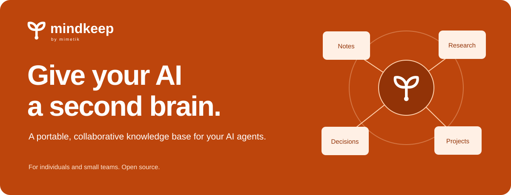
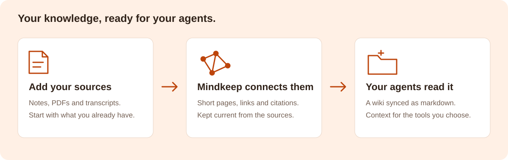

# Mindkeep



**A portable, collaborative knowledge base for your AI agents — for individuals and small teams.**

[](LICENSE)
[](https://github.com/mimetik-devops/mindkeep/actions/workflows/app.yml)
[](https://github.com/mimetik-devops/mindkeep/actions/workflows/ci.yml)

People drop documents into a folder. An agent reads each one and folds it into a wiki of
short, linked, cited pages — one per person, company, project, concept, meeting. The wiki
syncs back down to every teammate's machine as plain markdown that any local tool can
open: Claude Code, Obsidian, an editor, `grep`.



The agent builds the wiki from your sources. Correct a source and the pages follow;
delete a source and claims that depended on it are withdrawn.

You can also edit an existing wiki page in the web app. That edit is committed to the
bundle's history, but a later ingest may revise it again. For a lasting factual correction,
update the source. Synced local copies of `wiki/` remain mirrors: contribute through
`raw/` rather than editing those files in place.

---

## What you get

- **A wiki nobody has to write.** Upload a PDF, a transcript, a contract, a `.docx`; the
  agent decides which pages it bears on and rewrites them, with citations.
- **Pages that stay current.** A nightly pass looks for contradictions, orphans, stale
  drafts and uncited sources. What it cannot settle it does not guess — it writes the
  question down for a person who knows, and the task for a person who can do it.
- **Files, not a database.** Markdown on disk with a git repository inside every knowledge
  base. Every agent run is two commits and can be undone.
- **Context your other AI tools can read.** A synced folder gives an agent a catalog, short
  pages, explicit links and a citation under every claim, instead of a pile of PDFs — and a
  way to write back what it learns. See
  [Working with a coding agent](#working-with-a-coding-agent).
- **Your Notion pages and Drive folders, as sources.** Sign in once, choose what to share,
  and a sync keeps Markdown copies in the bundle. See [Connectors](#connectors).
- **Multi-tenant from the first line.** Teams, bundles, roles, invite links, and per-device
  revocable tokens. A team you are not a member of is a 404, never a 403.
- **Sign-in that needs nothing else.** Built-in e-mail and password accounts by default, or
  point it at any OIDC provider (Keycloak, Auth0, Zitadel, Logto, Kinde…).

## Quick start

Requires Docker and an OpenRouter API key with credits available.

```bash
git clone https://github.com/mimetik-devops/mindkeep.git
cd mindkeep

cp backend/.env.example backend/.env      # set OPENROUTER_API_KEY, DEVICE_SECRET, AUTH_SECRET
cp frontend/.env.example frontend/.env    # defaults are fine

docker compose up -d --build
```

Open <http://localhost:5163>, register an account, and drag a document onto the Library
tab. The first page appears when the run finishes.

Nothing else is required: with `AUTH_PROVIDER=builtin` (what `.env.example` ships) Mindkeep
uses local accounts and needs no external identity provider. Both the ingest agent and
the assistant send model requests through OpenRouter. Enabled connectors also contact
their source services; OIDC contacts your identity provider if configured.

| Service | Where | Notes |
|---|---|---|
| Web app | <http://localhost:5163> | Vite dev server, proxies `/api` |
| API | <http://localhost:8001> | uvicorn with reload |
| Postgres | `localhost:5433` | user / password / db all `mindkeep` |

Compose builds the `dev` target of each Dockerfile. The final stage of each is the
production image: the built site behind Caddy, and uvicorn without the reloader.

## Configuration

Everything lives in `backend/.env` and `frontend/.env`; both `.env.example` files document
every key. The ones that matter:

| Variable | What |
|---|---|
| `OPENROUTER_API_KEY` | credential for model requests through OpenRouter; usage is billed by OpenRouter |
| `LLM_MODEL` | OpenRouter model slug shared by both agents; see the example environment for the configured default |
| `INGEST_MODEL` | optional model override for ingestion and maintenance passes |
| `ASSIST_MODEL` | optional model override for the conversational assistant |
| `WIKI_ROOT` | where bundles live on disk (`/data`, a volume in production) |
| `DATABASE_URL` | Postgres; accounts, teams, runs and connection metadata; wiki content stays in files |
| `AUTH_PROVIDER` | `builtin` for Mindkeep's own accounts, `oidc` for a provider |
| `AUTH_SECRET` | builtin only: signs session tokens. Rotating it signs everyone out |
| `DEVICE_SECRET` | signs desktop-client tokens. Rotating it revokes every device |
| `LINT_HOUR` | default UTC hour for lint (3); outside 0–23 disables the default schedule |
| `DREAM_HOUR` | default UTC hour for dreaming (4); outside 0–23 disables the default schedule |

### Models and document input

The backend uses [its OpenRouter adapter](backend/app/llm.py), not the Anthropic SDK.
Set `LLM_MODEL` to an OpenRouter model slug, or use `INGEST_MODEL` and `ASSIST_MODEL`
to choose a different model for each agent. The checked-in default is
`anthropic/claude-sonnet-5`: that is a model identifier routed through OpenRouter,
not a requirement for a separate Anthropic API key.

Choose a model that supports tool calls. PDF ingestion also needs native file input;
Mindkeep sends PDFs as file parts and does not enable OpenRouter's file-parser plugin.
Word (`.docx`) files are converted to text before being sent to the model.

### Connections and scheduled passes

Website and Google Drive connectors bring external material into a bundle. Configure
Google OAuth credentials to offer Drive sign-in; the callback and public-URL settings
are documented in [backend/.env.example](backend/.env.example). Additional connector
packages can register through the `mindkeep.connectors` entry-point group.

Lint and dream are separate passes. Lint checks mechanical drift and repairs broken
source links. Dream reads the wiki for contradictions and missing connections, then
raises questions rather than rewriting pages. Each bundle can choose a schedule in
Settings: every specified number of hours, days or weeks, or disabled. Both passes
use the ingest model and consume model usage when they run.

### Connectors

A connector pulls sources from somewhere else into a bundle's `raw/connectors/` on a
schedule — Google Drive folders, Notion pages, a website. Drive and Notion sign in through
the provider's own consent screen (OAuth); the user picks what to share, and that choice
is the whole of what Mindkeep can see. In Notion the consent screen asks for pages: pick
a few, a top-level page (its children come along), or everything. Sharing later works
too — `•••` → *Connections* on any page adds it and what is under it, and removing the
connection takes it away again; the next sync follows either way. A connection can
narrow further to one subtree by its link, so two bundles can use the same sign-in.

For the consent screen to exist, the deployment has to be registered with the provider
as an app, once, by whoever runs it. That is what the client ID and secret are: the ID
names the app on the consent screen ("Mindkeep wants access to…") and the secret proves,
server to server, that it really is this deployment exchanging the sign-in code. They are
per deployment, not per user — everyone signs in through the same registered app — which
is why they are server configuration and never in the repository or the frontend.

| Variable | Register at |
|---|---|
| `GOOGLE_CLIENT_ID` / `GOOGLE_CLIENT_SECRET` | Google Cloud: an OAuth client of type *Web application*, the Drive API enabled |
| `NOTION_CLIENT_ID` / `NOTION_CLIENT_SECRET` | notion.so/my-integrations: a *public* integration |

Both need the redirect URI `<API_PUBLIC_URL>/grants/oauth/<drive|notion>/callback` —
`https://your-host/api/grants/oauth/notion/callback` when Caddy proxies `/api`. Left
blank, the connector is listed but greyed out; nothing else breaks.

## The desktop client

A sync engine, a CLI and a system-tray app that keep chosen bundles mirrored to folders on
a machine, both directions. Installers for Windows, macOS and Linux are attached to each
[release](https://github.com/mimetik-devops/mindkeep/releases).

**The installers are not code-signed.** Windows shows a SmartScreen warning ("More info" →
"Run anyway"); macOS needs a right-click → Open the first time; Linux does not care.

From source, without the tray app:

```bash
cd client
pip install -e .
mindkeep login          # opens the browser, stores a per-device token
mindkeep watch          # or `mindkeep sync` for a single pass
```

A file changed on both sides is never lost: your copy is kept under `.conflicts/` and the
server's lands in place.

## Working with a coding agent

A synced bundle is a folder of markdown, so any agent that can read a directory can use it:
Claude Code, Cursor, an editor's assistant, `grep`. Point one at the folder and ask.

```bash
cd ~/Mindkeep/Acme/default
claude "What did we decide about pricing, and what is that based on?"
```

The difference from pointing an agent at a shared drive is that a bundle arrives already
organised — `index.md` says what exists in one line per page, pages are short and linked,
and every claim carries a footnote to the source it came from. The agent reads a catalog
instead of guessing which of forty PDFs is relevant.

### The bundle tells the agent how to behave

Every bundle contains an `AGENTS.md`, written by Mindkeep and refreshed from
[the template](backend/app/templates/AGENTS.md) whenever the server starts. That is the
file Codex, Cursor, Copilot, pi, Aider, Zed and most other agents read on their own. Claude
Code reads only `CLAUDE.md`, so the bundle carries one of those too: a single line that
imports `AGENTS.md`. (Gemini CLI wants `GEMINI.md`; set its `context.fileName` to
`AGENTS.md` once.) The guide is not documentation for humans — it is the operating
instructions for whatever is reading, and it says four things:

- **This copy is a mirror — do not edit it in place.** `wiki/` is regenerated from the
  sources, so an edited page is overwritten the next time its source is read, and the sync
  removes anything the server does not have. To fix a wrong page, fix the source it cites.
- **Read `index.md` first**, then open only the pages it points to and follow their links.
  Prefer `stable` pages to `draft` ones, and a claim with a `verified` stamp over one
  without.
- **The mirror changes underneath you** — a sync rewrites files mid-session after an
  ingest, a lint, or a teammate's upload. Re-read a page before quoting it rather than
  answering from memory of what it said earlier.
- **Contribute findings back as notes**, never by writing into `wiki/`.

Without that last rule an agent does the natural thing — writes its conclusion into the
wiki as a page — and the next sync can remove it. Local wiki files are mirrors, and the
guide tells other agents how to contribute through sources instead.

### The way back in: notes

When a session settles something worth keeping — why a build fails and the fix, a decision
and its reasoning, a fact that took an hour to establish — the agent writes it as one
finding per file under `raw/notes/<person>/`:

```
raw/notes/ruben/2026-08-27 — why the frontend container lost its packages.md
```

```yaml
---
type: Note
author: ruben          # the person, not the tool
via: claude-code       # or whatever wrote it
about: [docker, frontend]
supersedes: raw/notes/ruben/2026-08-20 — rebuild the frontend image.md   # optional
---
```

That is a source like any other: the watcher uploads it, and the cloud agent folds it into
the wiki — with three rules that keep an inferred claim from passing as a checked one.
A page whose only source is a note is **`status: draft`** until a person verifies it, however
confident the note sounds, and it is cited with the note's `author` and `via`. A note naming
an earlier one in `supersedes:` **retires** the claims that rested on it. And a note that
changed on re-ingest has *changed its mind* — what is no longer in it is treated as
withdrawn, not merely unmentioned.

The result is a loop rather than a folder: your agent reads the team's knowledge, works,
and writes back what it learned, where the next person's agent will find it. What stays out
is anything about *your* machine or habits — paths, preferences, tooling quirks. That is
your agent's own memory, not the team's.

## How it works

1. **A source arrives** — dropped in the web app, written into a synced folder, or produced
   by the assistant from a conversation. PDFs go as file input to a compatible model;
   `.docx` files are extracted as text.
2. **A run opens.** One worker thread per bundle, so a wiki has exactly one writer at a
   time. The agent reads `index.md` first, then rewrites only the pages the source bears on.
3. **Two commits are made** — what people changed since the last run, then what the agent
   wrote. `index.md` is rebuilt by the server from the pages' own frontmatter.
4. **Anything unresolved is written down** in `questions.md` (for someone who knows) or
   `todo.md` (for someone who can do it).
5. **Scheduled lint and dream passes** check the bundle. Lint repairs broken source links
   and reports drift; dream reads the pages that changed since the last dream against
   their neighbours and raises questions about contradictions and missing connections —
   a night nothing changed costs no model call. A link graph helps reveal disconnected areas.

The agent's instructions are not a prompt buried in code — they are
[`backend/app/templates/manual.md`](backend/app/templates/manual.md), a versioned,
reviewed, tested document. If you want Mindkeep to behave differently, that is the file to
argue with.

## Repository layout

```
backend/     FastAPI + SQLAlchemy + Postgres. Routes, the ingest workers that run the
             agent, the nightly schedule, and a git repo inside every bundle.
  app/templates/manual.md    the agent's operating manual — the real spec
frontend/    React 19 + TypeScript + Vite. Library, graph, questions, activity, settings.
client/      The Python sync engine, the CLI, and the PySide6 tray app.
docs/        Developer onboarding and the architecture / decisions log.
```

## Development

Prerequisites: Docker, Node 22, Python 3.12+, git. Start with
[`docs/Mindkeep - Dev Onboarding.md`](docs/Mindkeep%20-%20Dev%20Onboarding.md) — it explains
the whole system in one sitting.

```bash
# backend — from backend/, in a venv with the dependency list + pytest ruff mypy
ruff check app tests && ruff format --check app tests && mypy app && python -m pytest -q tests

# frontend — from frontend/
npx tsc --noEmit -p tsconfig.json && npx eslint src && npx vitest run

# client — from client/, `pip install -e ".[app,dev]"`
ruff check . && pytest -q
```

CI runs all three on every pull request.

## Documentation

| Document | What it covers |
|---|---|
| [Developer onboarding](docs/Mindkeep%20-%20Dev%20Onboarding.md) | the system end to end: concepts, backend, frontend, client, deployment |
| [Dev log](docs/Mindkeep%20-%20Dev%20Log.md) | every architecture decision, why it was made, and what it replaced |
| [The agent's manual](backend/app/templates/manual.md) | how the agent decides what a page is, where it goes, and what it may claim |
| [The bundle guide](backend/app/templates/AGENTS.md) | the `AGENTS.md` shipped into every bundle (with a `CLAUDE.md` that imports it): how a local agent should read a mirror and write back to it |
| [CONTRIBUTING.md](CONTRIBUTING.md) | how to propose a change, and the DCO sign-off |
| [SECURITY.md](SECURITY.md) | how to report a vulnerability |

## Contributing

Issues and pull requests are welcome. Commits carry a `Signed-off-by:` line certifying the
[Developer Certificate of Origin](DCO) — `git commit -s` adds it. See
[CONTRIBUTING.md](CONTRIBUTING.md) for the conventions this codebase is held to; the
short version is that commit subjects are sentences, tests are the spec, and a change to
the agent's behaviour is a change to its manual.

## License

Copyright © 2026 mimetik. Mindkeep is free software under the
[GNU General Public License v3.0](LICENSE).

You may run it, study it, modify it and share it, for any purpose including a commercial
one. The condition is copyleft: **if you distribute Mindkeep or a modified version of it,
you must do so under the GPL and make the source available.** Running it for your own
team, modified or not, asks nothing of you.

A fully managed, hosted Mindkeep is planned as a paid option from
[mimetik](https://mimetik.ai) — the same code, the same files, and the same right to take
them and leave. Self-hosting is a first-class way to use Mindkeep and stays that way.
